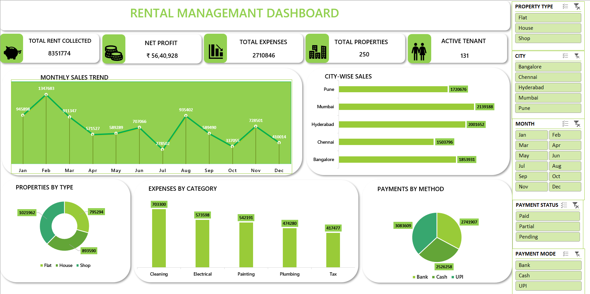

# 🏠 Rental Management Dashboard (Excel Project)

## 📌 Project Overview
This project analyzes rental income, expenses, properties, and tenant performance using Microsoft Excel.

## 🛠 Tools Used
- Microsoft Excel
- Pivot Tables
- Pivot Charts
- Slicers
- KPI Cards
- Custom Formatting

## 📊 Key Metrics
- Total Rent Collected
- Net Profit
- Total Expenses
- Total Properties
- Active Tenants

## 📈 Insights
- Monthly Sales Trend
- City-wise Performance
- Expenses by Category
- Property Type Distribution
- Payment Method Analysis

## 📊 Dashboard Preview

